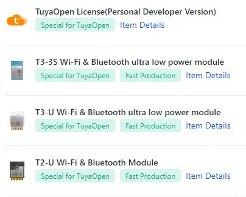

# Application Development Guide

## Create a product and obtain the product PID

Refer to the documentation [https://developer.tuya.com/en/docs/iot-device-dev/application-creation?id=Kbxw7ket3aujc](https://developer.tuya.com/cn/docs/iot-device-dev/application-creation?id=Kbxw7ket3aujc) to create a product on [https://iot.tuya.com](https://iot.tuya.com) and obtain the PID of the created product. Replace the `TUYA_PRODUCT_KEY` macro in the [apps/tuya_cloud/switch_demo/src/tuya_config.h](./src/tuya_config.h) file with the PID.

## Confirm the TuyaOpen authorization code

The Tuyaopen Framework includes:

- C for TuyaOpen: [https://github.com/tuya/TuyaOpen](https://github.com/tuya/TuyaOpen)
- Arduino for TuyaOpen: [https://github.com/tuya/arduino-TuyaOpen](https://github.com/tuya/arduino-TuyaOpen)
- Luanode for TuyaOpen: [https://github.com/tuya/luanode-TuyaOpen](https://github.com/tuya/luanode-TuyaOpen)

All versions use TuyaOpen dedicated authorization codes. Using other authorization codes will not allow normal connection to the Tuya Cloud.

```bash
[tuya_main.c:220] Replace the TUYA_DEVICE_UUID and TUYA_DEVICE_AUTHKEY contents, otherwise the demo cannot work
[tuya_main.c:222] uuid uuidxxxxxxxxxxxxxxxx, authkey keyxxxxxxxxxxxxxxxxxxxxxxxxxxxxx
```

The dedicated authorization code for TuyaOpen can be obtained through the following methods:

- Method 1: Purchase a module with a TuyaOpen authorization code pre-burned. The authorization code is already burned in the corresponding module at the factory and will not be lost. TuyaOpen reads the authorization code through the tuya_iot_license_read() interface at startup. Please confirm whether the current device has a TuyaOpen authorization code pre-burned.

- Method 2: If the current module is not pre-burned with a TuyaOpen authorization code, you can purchase an Open SDK Authorization Code through the https://platform.tuya.com/purchase/index?type=6 page and put 'TUYA_DEVICE_UUID' and 'TUYA_DEVICE_AUTHKEY' in the [apps/tuya_cloud/switch_demo/src/tuya_config.h](./src/tuya_config.h) file Replace the uuid and authkey obtained after successful purchase



```c
tuya_iot_license_t license;

if (OPRT_OK != tuya_iot_license_read(&license)) {
   license.uuid = TUYA_DEVICE_UUID;
   license.authkey = TUYA_DEVICE_AUTHKEY;
   PR_WARN("Replace the TUYA_DEVICE_UUID and TUYA_DEVICE_AUTHKEY contents, otherwise the demo cannot work");
}
```

If the `tuya_iot_license_read()` interface returns OPRT_OK, it indicates that the current device has a TuyaOpen authorization code pre-burned. Otherwise, it indicates that the current module is not pre-burned with a TuyaOpen authorization code.

## Build and Flash

- Run the `tos config_choice` command to select the current development board in use.
- If you need to modify the configuration, run the `tos menuconfig` command to make changes.
- Run the `tos build` command to compile the project.
- Use the tos flash command to flash the project in one click.

For more details about tos, please refer to [tos Guide](/tos_guide/index).

## Network Configuration and Device Activation

Use the Tuya APP to configure the network via Bluetooth or Wi-Fi AP mode and activate the device.
